<p align="center">
  
</p>

<p align="center">
  
</p>

<h1 align="center">Zenith</h1>

<p align="center">
  <strong>The floating AI assistant for support &amp; engineering replies.</strong><br />
  Always on top. One click. Rough notes in — polished copy on your clipboard.
</p>

<p align="center">
  <a href="https://github.com/Monty25803/zenith-floating-ai/releases/latest"></a>
  
  
  
  
</p>

<p align="center">
  <a href="https://github.com/Monty25803/zenith-floating-ai/releases/latest"><strong>Download for Windows →</strong></a>
  ·
  <a href="https://aistudio.google.com/apikey">Get a free Gemini API key</a>
  ·
  <a href="#how-it-works">How it works</a>
</p>

---

## Why Zenith

You already live in tickets, email, and chat. Zenith does not send you to another browser tab.

It sits as a **glass orb on your desktop**. Click it, dump messy notes, press **Refactor & Copy** — a clear, client-ready reply is copied instantly.

| Before | With Zenith |
| --- | --- |
| Rewrite the same reply three times | One draft → polished text |
| Alt-tab to a chat AI | Stay in your workflow |
| Copy / paste gymnastics | Auto-copy every time |
| Hotkeys to memorize | Click the orb |

**No backend. No account with us.** Your Gemini key never leaves this PC.

---

## Product tour

<p align="center">
  
</p>

<p align="center"><em>Always-on-top orb — drag to move, click or drag up to open.</em></p>

<p align="center">
  
</p>

<p align="center"><em>Split workspace — draft on the left, refined reply on the right.</em></p>

<p align="center">
  
</p>

<p align="center"><em>Settings — paste your Gemini key once. Optional Start with Windows.</em></p>

---

## How it works

1. **Install** Zenith and leave the orb running.
2. **Open** it when you need a reply — paste rough notes.
3. **Refactor & Copy** — paste (`Ctrl+V`) into your ticket, email, or chat.

That’s the whole loop. Minimize (or Esc) to tuck it away as a bubble again.

---

## Features

| | |
| --- | --- |
| **Floating orb** | Always on top, draggable, position remembered |
| **Split panel** | Draft left · refined output right |
| **Tone presets** | Support · Engineering · Email · Slack · Casual · Concise |
| **Secure key** | Windows Credential Manager · Gemini called from Rust |
| **One-click polish** | Streaming refine + auto clipboard · `Ctrl+Enter` |
| **Single instance** | Second launch focuses the existing app — no duplicate orbs |
| **System tray** | Show / Quit without cluttering the taskbar |
| **Start with Windows** | Optional autostart from Settings |
| **History** | Last refinements on-device only |
| **In-app updates** | Update alerts when a new installer ships |
| **Lightweight** | Tauri native shell — small footprint vs Electron |

---

## Install (Windows)

1. Open **[Releases → Latest](https://github.com/Monty25803/zenith-floating-ai/releases/latest)**
2. Download **`Zenith_*_x64-setup.exe`**
3. Run the installer (Current User)
4. Launch **Zenith** from the Start Menu

When a new version ships, Zenith shows an update banner — click **Update now**.

> Prefer building from source? See [Developers](#developers) below.

---

## Set up your Gemini key

Zenith talks to Google Gemini with **your** API key.

1. Create a key in **[Google AI Studio](https://aistudio.google.com/apikey)** (free tier available).
2. In Zenith: open the panel → **Settings** → paste → **Save key**.
3. Go **Back** and try **Refactor & Copy**.

<p align="center">
  
</p>

An **amber dot** on the orb means no key is saved yet.

## Privacy

- The key is stored in **Windows Credential Manager** (not browser localStorage).
- Draft text is sent to **Google Gemini** under your API key when you refine.
- Zenith has **no server** that receives your key or drafts.
- Treat the key like a password — never commit it. Use **Clear** in Settings anytime.

> **Windows SmartScreen:** until Authenticode / Azure Trusted Signing is configured, Windows may warn on first install. Prefer the official GitHub Release `setup.exe`. In-app updates remain signed with Tauri’s updater key.

---

## Controls

| Action | Result |
| --- | --- |
| Click orb | Open panel |
| Drag orb up | Expand to panel |
| Drag orb sideways | Move |
| **Refactor & Copy** / `Ctrl+Enter` | Polish + copy |
| Minimize / Esc / drag collapse grip | Back to orb |
| Tray · left-click | Show Zenith |
| `Ctrl+Alt+Space` | Open / focus panel |
| **Quit** (header / tray / right-click) | Exit after confirm |
| Launch again from Start Menu | Focus existing instance |
| Drag header / bubble | Reposition (bubble position saved) |

---

## Developers

### Stack

**React 19 · TypeScript · Vite 6 · Tailwind 4 · Tauri v2 · Gemini REST**

Models (with fallback): `gemini-3.8-flash` → `gemini-3.5-flash` → `gemini-3.5-flash-lite`

### Prerequisites

- [Node.js](https://nodejs.org/) 20+
- [Rust](https://rustup.rs/) (stable)
- Visual Studio Build Tools — **Desktop development with C++**
- WebView2 (usually preinstalled on Windows 10/11)
- A [Gemini API key](https://aistudio.google.com/apikey)

### Run locally

```bash
npm install
npm run tauri dev
```

```bash
npm run build              # frontend only
npm run tauri build        # production bundles
npm run icons:all          # refresh OS icons from brand assets
```

### Releases (maintainers)

Push a version tag (`v0.1.42`) or run the **Release Windows installer** workflow manually. CI builds NSIS `*-setup.exe`, signs updater artifacts, and publishes a GitHub Release with `latest.json`.

| Secret | Purpose |
| --- | --- |
| `TAURI_SIGNING_PRIVATE_KEY` | From `npm run tauri signer generate` |
| `TAURI_SIGNING_PRIVATE_KEY_PASSWORD` | Key password (empty string if none) |

---

## Troubleshooting

| Symptom | Fix |
| --- | --- |
| Amber dot on orb | Save a Gemini key in **Settings** |
| Green dot / update banner | Open panel → **Update now** |
| Busy / high demand | Wait and retry — Zenith already retries + switches models |
| Invalid API key | Create a new key in AI Studio and save again |
| Can’t find the orb | Check bottom-right / tray · Show Zenith |
| Build fails (Rust / MSVC) | Install Rust + VS C++ workload, reopen the terminal |

---

## Brand

| Asset | Use |
| --- | --- |
| [zenith-orb-pro.svg](public/zenith-orb-pro.svg) | Floating bubble |
| [zenith-icon.png](public/zenith-icon.png) | Panel mark · installer icons |
| [zenith-wordmark.png](public/zenith-wordmark.png) | Docs & marketing |

*The peak of your productivity stack.*

---

<p align="center">
  <strong>Zenith</strong> · Windows-first · Open distribution · Updates via GitHub Releases<br />
  <a href="https://github.com/Monty25803/zenith-floating-ai/releases/latest">Download the latest setup.exe</a>
</p>
