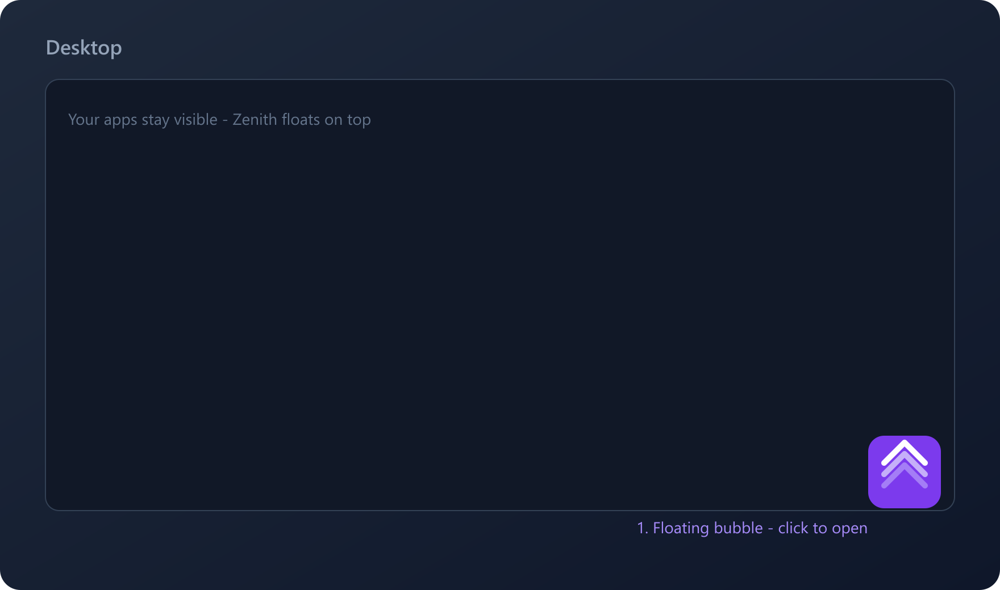
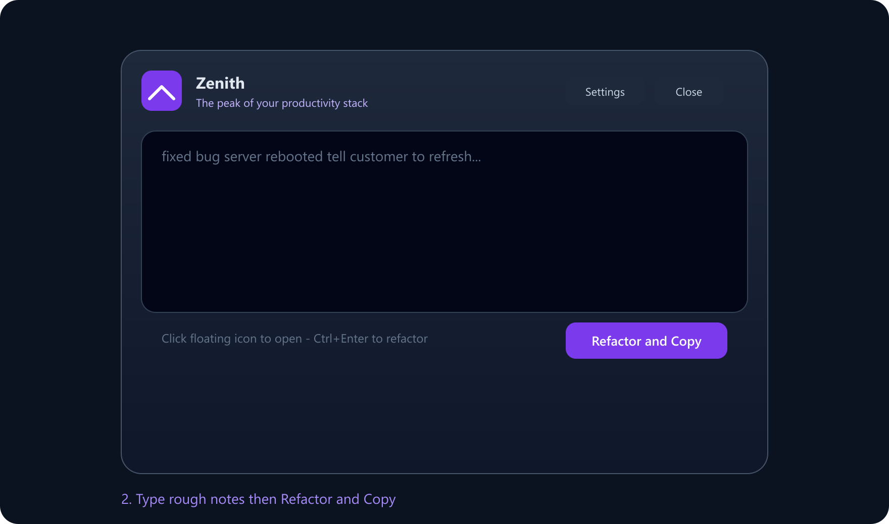
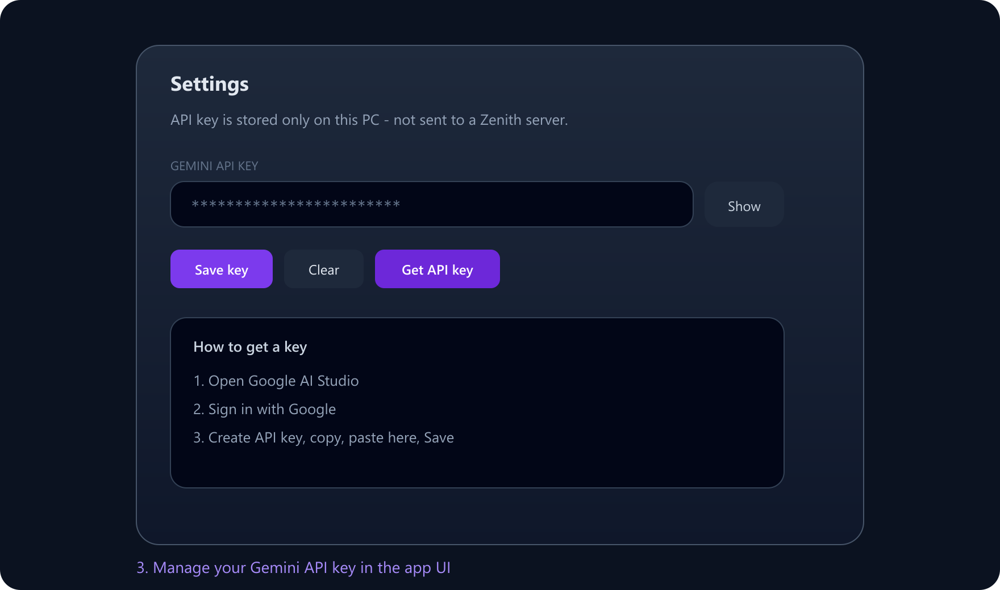
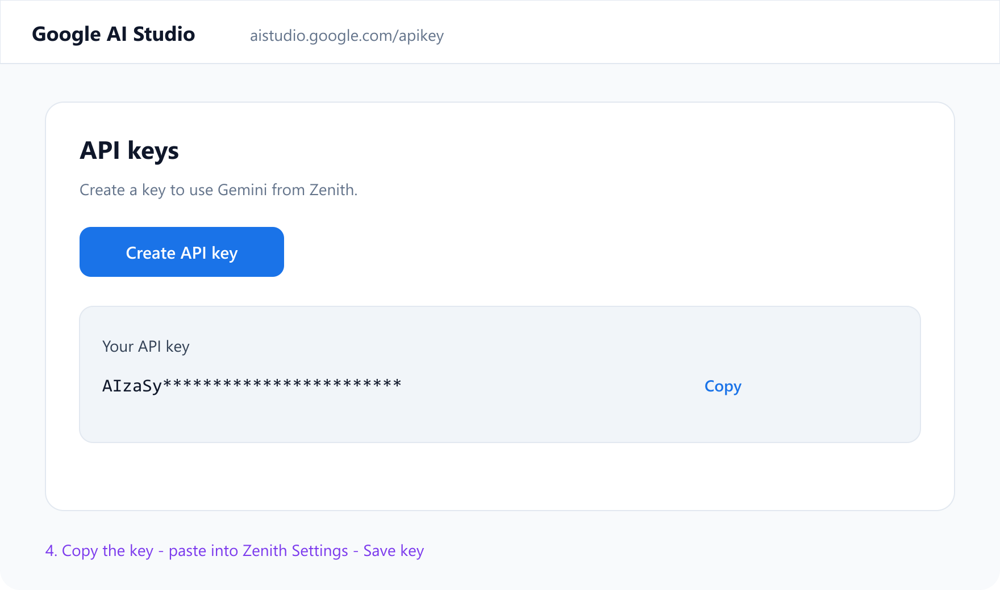

<p align="center">
  
</p>

<h1 align="center">Zenith Floating AI Assistant</h1>

<p align="center">
  <strong>Click. Rewrite. Paste.</strong><br />
  A always-on-top Windows bubble that turns rough notes into polished support replies via Google Gemini.
</p>

<p align="center">
  
</p>

---

## What it does

Support and engineering work often means juggling tickets, email, and chat. Zenith sits as a small floating icon on your desktop. Click it, dump rough notes, hit **Refactor & Copy** — get a clear, professional reply on the clipboard, ready to paste.

| Without Zenith | With Zenith |
|----------------|-------------|
| Rewrite the same reply 3 times | One rough draft → polished text |
| Switch to a browser AI tab | Stay in your ticket / email flow |
| Copy/paste gymnastics | Auto-copy on every refactor |

**No global hotkey.** No backend. Your Gemini API key lives only on your PC (Settings UI → local storage).

---

## Features

- **Floating bubble** — always on top, draggable, collapses when you close the panel
- **One-click refactor** — Gemini rewrites informal notes into client-ready replies
- **Auto clipboard** — output is copied instantly; **Ctrl+Enter** to run
- **In-app API key** — paste, save, clear — no `.env` required for day-to-day use
- **Resilient AI calls** — retries + model fallbacks when Google is overloaded
- **Tiny desktop footprint** — Tauri (~15–20 MB class) vs Electron-heavy shells
- **Windows installer releases** — every push to `main` publishes a `.exe` setup on GitHub Releases
- **In-app update alerts** — installed apps detect new releases and offer **Update now**

---

## Install (Windows users)

Anyone can install Zenith from the public Releases page — **do not** run a raw binary from a zip.

1. Open **[Releases](https://github.com/Monty25803/zenith-floating-ai/releases/latest)**
2. Download **`Zenith_*_x64-setup.exe`**
3. Run the installer (Current User install)
4. Launch **Zenith** from the Start Menu — a floating bubble appears

When a newer release is published, Zenith shows an update alert. Click **Update now** to download the new setup and restart.

---

## Design

### Brand

| Asset | Use |
|-------|-----|
|  | Floating bubble, favicon, Windows installer icons |
|  | Docs, marketing, README |

- **Mark** — purple squircle with three rising chevrons (“peak”)
- **Wordmark** — *Zenith* + tagline *The peak of your productivity stack*
- Rebuild OS icons after logo changes: `npm run icons:all`

### UI language

| Token | Value | Role |
|-------|-------|------|
| Peak purple | `#7C3AED` | Brand tile, primary actions |
| Soft violet | `#A78BFA` / `#C4B5FD` | Accents, secondary chevrons |
| Slate glass | `slate-900` @ ~85% + blur | Panel surface |
| Ink / muted | white / `slate-400` | Titles and helper text |
| Amber | warning dot | API key missing on bubble |

**Layout rules**

1. **Bubble mode** — 64×64 transparent window; icon only (no glow bleed)
2. **Panel mode** — ~600×440 glass card; drag via header
3. **One job per view** — write → refactor, or settings → save key
4. **Close / Esc** — always returns to the floating bubble

### Visual guide

**1. Floating bubble** — always on top; click to open



**2. Main panel** — rough notes in, polished reply out



**3. API settings** — save your Gemini key in the app UI



**4. Get an API key** — Google AI Studio



---

## Tech stack

```text
┌─────────────────────────────────────────────────────────┐
│  React 19 + TypeScript + Vite 6 + Tailwind CSS 4        │
│  (glass UI · bubble / panel / settings)                 │
└───────────────────────────┬─────────────────────────────┘
                            │  @tauri-apps/api
┌───────────────────────────▼─────────────────────────────┐
│  Tauri v2 (Rust)                                        │
│  · frameless · transparent · alwaysOnTop · skipTaskbar  │
│  · clipboard-manager · opener                           │
└───────────────────────────┬─────────────────────────────┘
                            │  HTTPS REST (your API key)
┌───────────────────────────▼─────────────────────────────┐
│  Google Gemini                                          │
│  gemini-3.8-flash → 2.5-flash → 2.5-flash-lite          │
│  (+ retries on high demand / rate limit)                │
└─────────────────────────────────────────────────────────┘
```

| Layer | Choice | Why |
|-------|--------|-----|
| Shell | **Tauri v2** | Small native Windows app, transparent overlay windows |
| UI | **React 19 + TS** | Typed, fast iteration for a single-panel UX |
| Bundler | **Vite 6** | Instant HMR during `tauri dev` |
| Styles | **Tailwind CSS 4** | Utility-first glassmorphism without a heavy design system |
| Clipboard | `@tauri-apps/plugin-clipboard-manager` | Reliable system paste after refactor |
| Links | `@tauri-apps/plugin-opener` | Open AI Studio from Settings |
| AI | **Gemini REST** | Direct from UI — no Zenith backend |
| Icons | **sharp** + `tauri icon` | PNG → Windows `.ico` / installer assets |

### Project layout

```text
Zenith App/
├── src/
│   ├── App.tsx                 # Bubble ↔ panel ↔ settings
│   ├── brand/ZenithMark.tsx    # Logo component
│   ├── lib/
│   │   ├── apiKey.ts           # LocalStorage key helpers
│   │   ├── gemini.ts           # Model chain + retries
│   │   ├── updater.tsx         # Update check + alert UI
│   │   └── windowModes.ts      # Bubble / panel geometry
│   ├── index.css               # Transparent root + bubble motion
│   └── main.tsx
├── .github/workflows/
│   └── release-windows.yml     # Build + publish setup.exe on push
├── src-tauri/
│   ├── tauri.conf.json         # Overlay window config
│   ├── capabilities/           # Clipboard, window, opener ACL
│   └── icons/                  # Generated OS icons
├── public/
│   ├── zenith-icon.png         # Peak mark
│   └── zenith-wordmark.png     # Full logo
├── docs/screenshots/           # README visuals (SVG)
└── scripts/generate-app-icon.mjs
```

---

## Quick start

### Prerequisites

| Tool | Notes |
|------|--------|
| [Node.js](https://nodejs.org/) 20+ | Frontend + Tauri CLI |
| [Rust](https://rustup.rs/) (stable) | Native shell |
| VS Build Tools | **Desktop development with C++** workload (Windows) |
| WebView2 | Usually preinstalled on Windows 10/11 |
| [Gemini API key](https://aistudio.google.com/apikey) | Free tier; set inside the app |

### Develop

```bash
npm install
npm run tauri dev
```

A purple peak bubble appears (typically bottom-right). **Drag** to move · **Click** to open.

### Ship / release (maintainers)

Every push to `main` runs GitHub Actions (`.github/workflows/release-windows.yml`):

1. Bumps version to `0.1.<run_number>`
2. Builds a Windows **NSIS** installer (`*-setup.exe`)
3. Signs updater artifacts
4. Publishes a GitHub Release with `latest.json` for auto-update

Required repo secrets:

| Secret | Purpose |
|--------|---------|
| `TAURI_SIGNING_PRIVATE_KEY` | Private key from `npm run tauri signer generate` |
| `TAURI_SIGNING_PRIVATE_KEY_PASSWORD` | Key password (empty string if none) |

Local production build (optional):

```bash
npm run tauri build -- --bundles nsis
```

Installer output: `src-tauri/target/release/bundle/nsis/`

### Scripts

| Command | Purpose |
|---------|---------|
| `npm run tauri dev` | Dev app + Vite HMR |
| `npm run tauri build` | Production MSI / NSIS |
| `npm run build` | Frontend-only TypeScript + Vite build |
| `npm run icons:all` | Refresh `app-icon-source.png` + all OS icons |

---

## How to use

| Action | Result |
|--------|--------|
| Click floating icon | Opens glass panel |
| **Refactor & Copy** / **Ctrl+Enter** | Gemini polish + clipboard |
| **Settings** | Paste / save / clear API key |
| **Close** / **Esc** | Back to bubble |
| Drag header / bubble | Reposition |

### Everyday loop

1. Leave Zenith running (bubble stays on top).
2. In a ticket or email, click the bubble.
3. Paste rough notes → **Refactor & Copy**.
4. Paste (`Ctrl+V`) into your tool.
5. Close — bubble waits for the next reply.

---

## Gemini API key (full guide)

### Get a key

1. Open **[Google AI Studio → API keys](https://aistudio.google.com/apikey)**  
   (or **Get API key** inside Zenith Settings).
2. Sign in with Google.
3. **Create API key** (pick / create a Cloud project if asked).
4. **Copy** the key.


### Save it in Zenith

1. Click the floating icon → **Settings**.
2. Paste into **Gemini API key** → **Save key**.
3. **Back** → try **Refactor & Copy**.

An **amber dot** on the bubble means no key is stored yet.

### Safety

- Treat the key like a password — never commit it or paste it into public chats.
- Storage is **local only** (this machine). Zenith has no server that receives your key.
- **Clear** anytime from Settings; rotate the key in AI Studio if it leaks.
- Usage follows Google’s free-tier / billing rules for your account.

---

## Architecture notes

- **Window** — frameless, transparent, `alwaysOnTop`, `skipTaskbar`; resizes between bubble and panel.
- **AI path** — browser `fetch` to Generative Language API with the key from local storage.
- **Fallback chain** — `gemini-3.8-flash` → `gemini-2.5-flash` → `gemini-2.5-flash-lite`, with backoff on 429/503 / “high demand”.
- **System prompt** — support/dev rewrite only; returns refined text with no chatty preamble.

---

## Troubleshooting

| Symptom | What to try |
|---------|-------------|
| Green dot on bubble / update banner | New version available — open panel and click **Update now** |
| Amber dot on bubble | Open **Settings** and save a Gemini key |
| “High demand” / busy | Wait and retry — Zenith already retries + switches models |
| Auth / invalid key | Create a new key in AI Studio and save again |
| Bubble missing after launch | Check the taskbar-less always-on-top corner; restart `tauri dev` |
| Build fails (Rust / MSVC) | Install Rust + VS C++ workload; reopen the terminal |

---

## License / status

Public open distribution · Windows-first (Tauri) · Auto-updates via GitHub Releases.
